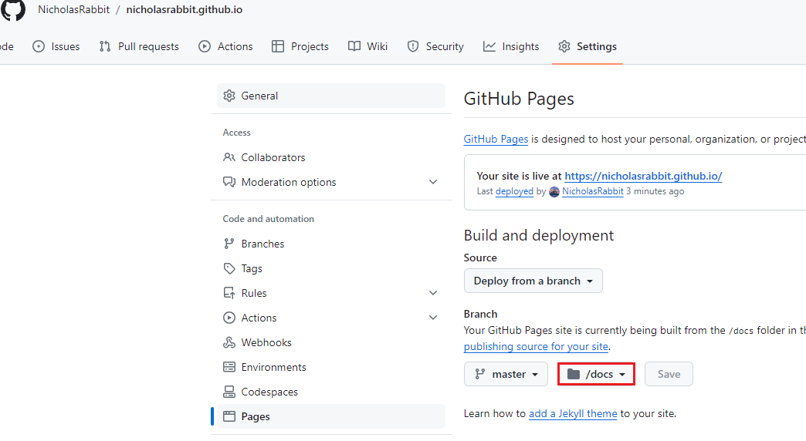

[Quick Start with Jekyll](https://jekyllrb.com/docs/)

### 1, Install Jekyll

1) Install prerequisites

Linux: CentOS

```shell
sudo dnf install ruby ruby-devel
sudo dnf group install "Development Tools"
```

2)  Requirements

- [Ruby](https://www.ruby-lang.org/en/downloads/) version **2.5.0** or higher, including all development headers (check your Ruby version using `ruby -v`)
- [RubyGems](https://rubygems.org/pages/download) (check your Gems version using `gem -v`)
- [GCC](https://gcc.gnu.org/install/) and [Make](https://www.gnu.org/software/make/) (check versions using `gcc -v`,`g++ -v`, and `make -v`)

3)  Make sure you add `4000` to the excluded ports of Linux firewall.

4)  If you run `bundle exec jekyll serve`, you can only visit the page on localhost. 

​     4.1 Visit Jekyll server outside of the local host:

```shell
 bundle exec jekyll serve --host 0.0.0.0 --port 8080 
 # or 
 jekyll serve --host 0.0.0.0 --port 8080 
```

   4.2 Run server on a specific port

```shell
 jekyll serve --port 8080 
```

### 2, Create site with Jekyll

[Official Documents](https://docs.github.com/en/pages/setting-up-a-github-pages-site-with-jekyll/creating-a-github-pages-site-with-jekyll?platform=linux)

1) In conclusion, Jekyll is nothing but a generator and a  server to help you preview your website in local environment before it published. 

2) Set public resources.

If you select `/docs` , only the source in this directory will be published and it is also the root directory  where Jekyll build the website.




### 3, Add new content manually.

You can create a new page by yourself. In the root directory of your publish source such as `docs` create a new file named `contact.md` and add the following YAML formatter to the top of your file.

```markdown
layout: page
title: "Contact Me"
permalink: /contact

your content
```

Then the address of this page is `xxx.github.io/contact`. If you create a new directory and put `xxx.md` files there , the URL is `xxx.githu.io/newDirectory/contact`.  Visitors can be redirected to this page by click a hyper reference you add in another page. The hyper reference link is like `/contact` without the context path. 

### 4, Front Matter

Type ```` yaml` /`---`  or copy the front matter from another template to add content of YAML format.

```yaml
---
title: Cheatsheet
layout: page
---
```

### 5, Updating the GitHub Pages gem

Jekyll is an active open source project that is updated frequently. If the `github-pages` gem on your computer is out of date with the `github-pages` gem on the GitHub Pages server, your site may look different when built locally than when published on GitHub. To avoid this, regularly update the `github-pages` gem on your computer.

1. Open Terminal.
2. Update the github-pages gem.
   - If you installed Bundler, run `bundle update github-pages`.
   - If you don't have Bundler installed, run `gem update github-pages`.

### 6, Gemfile

It is extremely difficult to connect "rubygems.org" when I was trying to run `bundle` as [the guidance](https://jekyllrb.com/docs/step-by-step/01-setup/) said.

When you are running `bundle`, the mirror site in `Gemfile` is "https://rubygems.org/" which is not accessed in China; you should replace it with " https://gems.ruby-china.com". 

